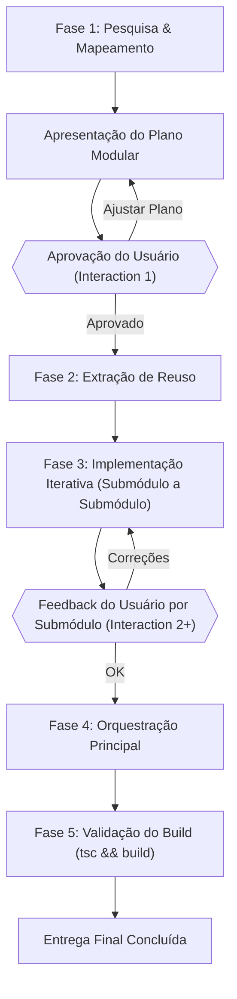

# Guia de Desenvolvimento Modular (/padrao-front) para IAs

Este guia estabelece a metodologia de trabalho detalhada que eu (Antigravity) e outros agentes de IA devemos seguir ao implementar ou refatorar telas no projeto NinoPDV, garantindo que o padrão `/padrao-front` seja executado com alinhamento constante, modularidade estrita e alta interação com o desenvolvedor.

---

## 🧭 Princípios Fundamentais

1. **Modularidade Progressiva**: Uma tela não é um arquivo único. Ela é uma colagem de submódulos pequenos e especializados que se comunicam.
2. **Tríade de Arquivos Obligatória**: Cada submódulo deve viver em sua própria pasta e conter exatamente três arquivos:
   - **`[Componente]State.ts`**: Gancho de estado (hook) e regras de lógica pura (validações, atalhos, formatação).
   - **`[Componente].css`**: Estilização isolada, focada em classes locais (evitando poluição global).
   - **`[Componente].tsx`**: Template e estrutura visual (JSX). **Não deve conter lógica complexa** ou manipulação direta de dados que não venha do hook ou de props.
3. **Reuso Obsessivo**: Antes de criar qualquer novo componente, formulário, seletor ou modal, o repositório deve ser vasculhado em busca de código que possa ser extraído ou reaproveitado (ex: cadastros de setores, tabelas comuns).
4. **Desenvolvimento Iterativo e Comunicativo**: Nunca reescrever uma tela inteira de uma vez. O processo deve ser fatiado em entregas incrementais com validações explícitas.

---

## 🗺️ Fluxo de Trabalho Passo a Passo (Manual do Agente)



### 🔍 Fase 1: Pesquisa, Mapeamento e Proposta
Antes de digitar qualquer linha de código:
- **Investigação**: A IA deve analisar a tela atual, seus estados e dependências.
- **Checagem de Reuso**: Pesquisar se já existem módulos criados no projeto (como `ModalCategorias`, `FiltroProdutos`, etc.) que possam ser estendidos ou reutilizados.
- **Proposta de Divisão**: Elaborar uma lista clara de quais subcomponentes serão criados.
- **Checkpoint Interativo**: Apresentar essa proposta ao usuário no chat e **aguardar sua aprovação** antes de criar arquivos.

### 📐 Fase 2: Estrutura da Pasta do Componente
Para cada módulo aprovado, criar a estrutura isolada de pastas:
```
src/telas/NomeTela/components/NomeModulo/
├── NomeModulo.tsx       (Estrutura Visual)
├── NomeModulo.css       (Estilização Local)
└── NomeModuloState.ts   (Lógica e Hooks)
```

### 🛠️ Fase 3: Desenvolvimento Iterativo
- **Construção Focada**: Codificar um único submódulo por vez.
- **Qualificadores de Tipo**: Usar estritamente `import type` para interfaces e tipos TypeScript para evitar problemas de HMR (Hot Module Replacement) e empacotamento no Vite.
- **Apresentação de Progresso**: Explicar o que foi feito no submódulo antes de passar para o próximo, permitindo que o usuário identifique desvios logo no início do fluxo.

### 🔗 Fase 4: Orquestração Central
- O componente principal (ex: `TelaCheckout.tsx` ou `TelaEstoque.tsx`) deve apenas importar os submódulos prontos e passar a eles o estado gerenciado por um hook orquestrador global (`TelaCheckoutState.ts` / `useTelaCheckout`).
- O CSS principal da tela deve ser reduzido a resets básicos de contêineres e definições de grids estruturais.

### 🧪 Fase 5: Verificação e Build
- Rodar `npx tsc --noEmit` para validação estática de tipos.
- Executar `npm run build` para garantir que o processo de build do Vite/Rollup empacota o código perfeitamente sem problemas de escopo de variáveis ou imports em runtime.

---

## 🎯 Checklist de Qualidade para IAs

- [ ] Verifiquei se existe componente similar para reuso?
- [ ] O arquivo `.tsx` possui alguma lógica que poderia ser extraída para o `.ts`?
- [ ] Todos os imports de interfaces usam `import type`?
- [ ] O componente pai está limpo de markup e lógica interna pesada?
- [ ] O build do Vite rodou com sucesso localmente?
