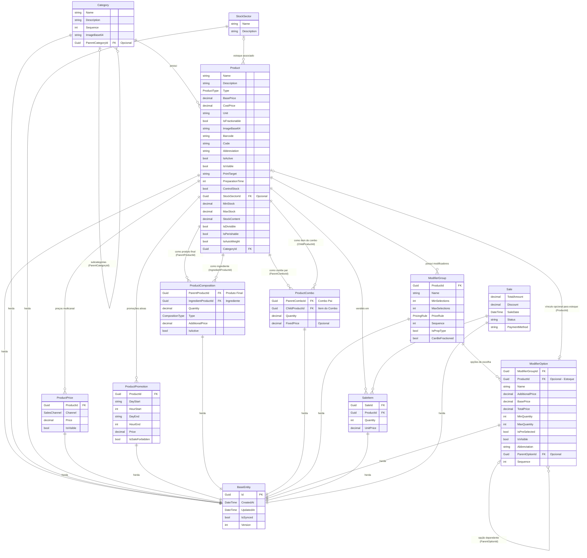
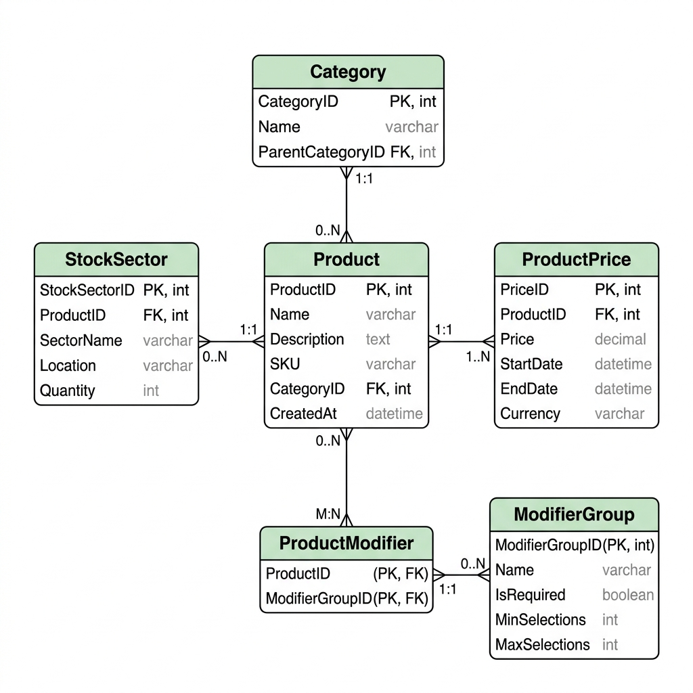
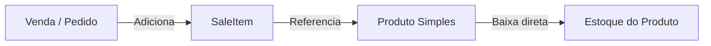
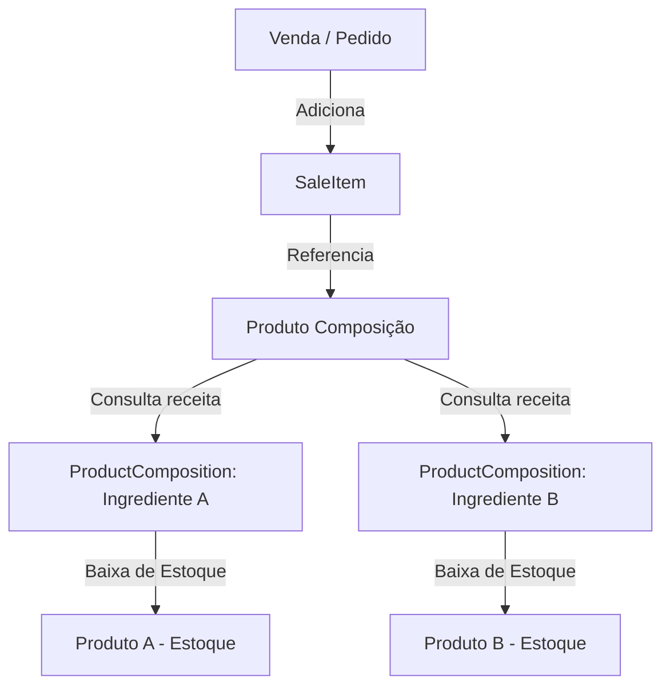
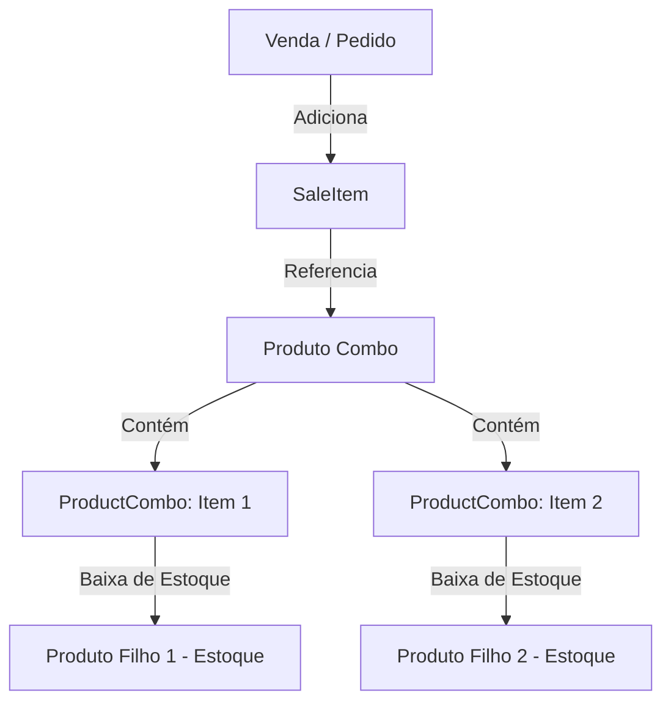

# Relação de Tabelas e Fluxo de Produtos no NinoPDV

Esta documentação detalha a estrutura de banco de dados e as relações das tabelas que envolvem o **Produto** (`Product`) no sistema NinoPDV. 

O NinoPDV suporta diferentes tipos de produtos (Simples, Composição e Combo) e possui mecanismos para precificação multicanal, promoções agendadas, grupos de modificadores (como adicionais, tamanhos e sabores) e controle de estoque por setor.

---

## 1. Diagrama de Entidade-Relacionamento (ERD)

Abaixo está o diagrama Mermaid que representa as tabelas e seus relacionamentos. Todas as entidades herdam as propriedades comuns de `BaseEntity`.

### Versão Visual do Diagrama ERD

Caso seu leitor de Markdown não renderize o bloco Mermaid acima, você pode visualizar a imagem do diagrama abaixo:

---

## 2. Tipos de Produto (`ProductType`)

O campo `Type` na entidade `Product` determina o comportamento operacional do item no sistema de vendas e de estoque. Os tipos suportados são descritos a seguir:

### A. Produto Simples (`ProductType.Simple = 0`)
Representa um item unitário padrão vendido diretamente.
* **Exemplos**: Lata de Coca-Cola, Água Mineral, Chocolate em Barra.
* **Estoque**: Controlado diretamente na tabela `Product` baseado nas colunas `ControlStock`, `MinStock`, `MaxStock` e o saldo atual.
* **Venda**: Adicionado diretamente ao carrinho de vendas (`SaleItem`).

### B. Produto Composição (`ProductType.Composition = 1`)
Representa uma receita ou prato composto por múltiplos ingredientes cadastrados no sistema.
* **Exemplos**: Hambúrguer Gourmet (Pão, Carne, Queijo, Maionese), Milkshake.
* **Estoque**: Quando a composição é vendida, o sistema pode baixar o estoque proporcional de cada ingrediente associado na tabela `ProductComposition`.
* **Configuração**: Mapeia relacionamentos na tabela `ProductComposition`, especificando a quantidade consumida de cada ingrediente (`IngredientProductId`), se o ingrediente é obrigatório (`Fundamental`) ou opcional.

### C. Produto Combo (`ProductType.Combo = 2`)
Representa um pacote promocional ou kit composto por vários produtos vendidos em conjunto por um valor fechado ou com descontos.
* **Exemplos**: Combo Clássico (1 X-Salada, 1 Batata Média, 1 Refrigerante Lata).
* **Precificação**: Pode utilizar o preço do combo principal ou aplicar descontos e preços fixos específicos para os itens internos na tabela `ProductCombo` (`FixedPrice`).
* **Estoque**: A venda do combo gera a baixa do estoque dos itens individuais que compõem o combo (`ChildProductId`).

---

## 3. Descrição Detalhada das Tabelas Relacionadas

### `Product`
A tabela central de cadastro. Além de informações básicas de exibição (nome, descrição, preço base, imagem), armazena metadados de controle de estoque (`ControlStock`, `MinStock`, `MaxStock`), tempo de preparo e regras de fracionamento.

### `Category`
Organiza os produtos em grupos lógicos (ex: "Bebidas", "Lanches"). Suporta uma estrutura de árvore infinita de subcategorias usando o campo autorreferenciável `ParentCategoryId`.

### `StockSector`
Define em qual setor físico ou lógico o produto é armazenado (ex: "Cozinha", "Adega", "Dispensa"). Permite segmentar a gestão de estoque e impressão de pedidos de produção.

### `ProductPrice`
Permite definir múltiplos preços para o mesmo produto dependendo do canal de venda utilizado (por exemplo: um preço para Balcão, outro para Delivery e outro para Drive-Thru). É mapeado usando o enum `SalesChannel`.

### `ProductPromotion`
Permite criar regras de desconto temporais. O sistema verifica se o momento atual da venda corresponde ao intervalo de dias da semana e horários definidos na promoção (`DayStart`/`HourStart` a `DayEnd`/`HourEnd`) para aplicar o preço promocional de forma automática.

### `ModifierGroup` e `ModifierOption`
Utilizados para gerenciar as variações e adicionais dos produtos:
* **`ModifierGroup`**: Um grupo de opções (ex: "Escolha o Ponto da Carne", "Escolha a Borda da Pizza"). Define limites mínimos (`MinSelections`) e máximos (`MaxSelections`) de escolha.
* **`ModifierOption`**: As opções em si (ex: "Bem passado", "Borda de Catupiry"). Uma opção pode cobrar um valor adicional (`AdditionalPrice`). Se a opção for um produto físico que precisa baixar estoque (como "Borda de Catupiry" que consome catupiry cadastrado como insumo), ela pode se associar a um `ProductId` para que o estoque seja baixado.
